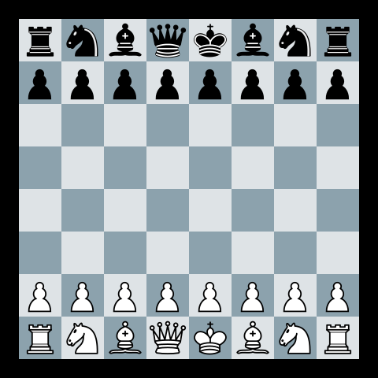
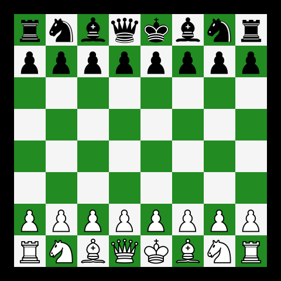
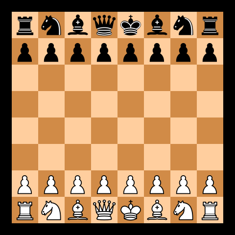

# Pgn2gif

Create GIFs from PGNs

## Usage

Run `./pgn2gif` with the following options:

```
Usage: pgn2gif [OPTIONS] COMMAND [ARGS]...

  Create GIFs from PGNs

Options:
  -p, --path TEXT                 path to the pgn file/folder
  -s, --speed FLOAT               speed with which pieces move in gif.
  -o, --out TEXT                  name of the output folder
  -si, --size INTEGER             size of the gif
  -c, --color [green|blue|brown]  color of chess board
  -g, --game-index INTEGER        index of the game for which gif is to be
                                  made
  --all-games                     make gif of all the games found in a PGN
  --help                          Show help screen.

Commands:
  chess_com  Get games played on chess.com
  lichess    Get games played on lichess
```

You can also run `./pgn2gif` without any external options and in that case `./pgn2gif` will run on the following default values:

```
* path          current working directory
* speed         0.5
* out           folder name `gifs` in current working directory
* size          480 X 480
* color         Brown
* game-index    1st
```

## Examples

* `./pgn2gif`


* `./pgn2gif -c blue`



* `./pgn2gif  -c green`



* `./pgn2gif -p /home/mzfr/dev/mzfr.pgn`


* `./pgn2gif -p /home/mzfr/dev/mzfr-1.pgn -s 0.2`



* `./pgn2gif  -si 600 -s 0.1`


* `./pgn2gif  -si 680`


## Installation

* You'll need Python3.

* Clone the repository

```
git clone https://github.com/mzfr/pgn2gif
```

* Run `pip install -r requirements.txt`

